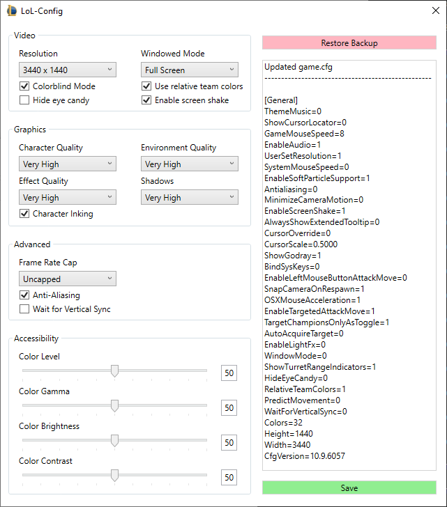

# LoL-Config
Utility to edit League of Legends in-game video/graphics settings while not in-game.\
*LoL-Config can backup, restore, and make changes to your game.cfg file.*

Download latest version: [Lol-Config 0.1.5](https://github.com/WelFedTed/LoL-Config/releases/download/0.1.5/LoL-Config.exe)

Icon Source
[PNGBarn.com](https://www.pngbarn.com/search?q=League+of+Legends+Free+Icon%2C+LoL+Icon%2C+Blue+)